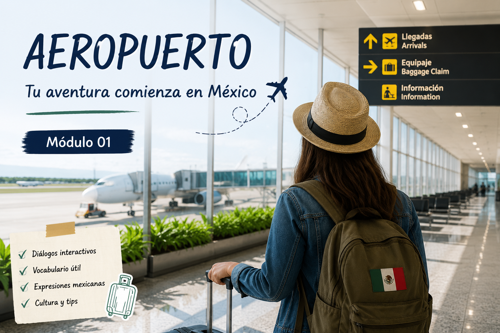

# ✈️ Recupera tu maleta

  

Llegar a un nuevo país puede ser emocionante, pero también un poco estresante.

En este módulo practicarás vocabulario y expresiones relacionadas con viajes, aeropuertos y situaciones imprevistas durante un intercambio académico en México.

---

# 🛄 Situación

Acabas de aterrizar en el Aeropuerto Internacional de la Ciudad de México.

Sin embargo, descubres que tu maleta ha desaparecido y necesitas recuperarla antes de tomar tu vuelo de regreso a Praga.

Durante esta aventura deberás:
- pedir ayuda
- hablar con personal del aeropuerto
- seguir indicaciones
- tomar decisiones rápidas
- comprender palabras en diferentes contextos

---

# 🎯 Objetivos

Al finalizar este módulo podrás:

- utilizar vocabulario relacionado con viajes y aeropuertos
- pedir ayuda de manera educada
- comprender instrucciones básicas
- interactuar en situaciones cotidianas
- resolver problemas comunicativos simples

---

# 🧩 Vocabulario útil

| Español | Significado |
|---|---|
| equipaje | luggage |
| boleto | ticket |
| puerta de embarque | boarding gate |
| pasaporte | passport |
| seguridad | security |
| vuelo | flight |
| salida | exit |
| ayuda | help |

---

# 💬 Expresiones comunes

## “¿Me puede ayudar?”
Forma educada de pedir ayuda.

---

## “Perdí mi maleta.”
Expresión útil en el aeropuerto.

---

## “¿Dónde está la puerta de embarque?”
Pregunta frecuente durante un viaje.

---

## “Necesito encontrar mi equipaje.”
Expresión para explicar un problema.

---

# 🎮 Actividad interactiva

Realiza la aventura interactiva creada en Twine.

👉 [Abrir actividad interactiva](https://margerar.github.io/mi-curso-elemex/02-aeropuerto/twine/index.html ':target=_blank')

---

# 🌮 Diferencia cultural

Los aeropuertos internacionales suelen mezclar diferentes idiomas, culturas y formas de comunicación.

Durante un intercambio es importante:
- pedir ayuda con cortesía
- mantener la calma
- comprender señales y anuncios
- adaptarse a situaciones nuevas

---

# 🚀 Continuar

👉 [Ir al módulo de expresiones mexicanas](https://margerar.github.io/mi-curso-elemex/03-expresiones/03-01.expresiones.md)