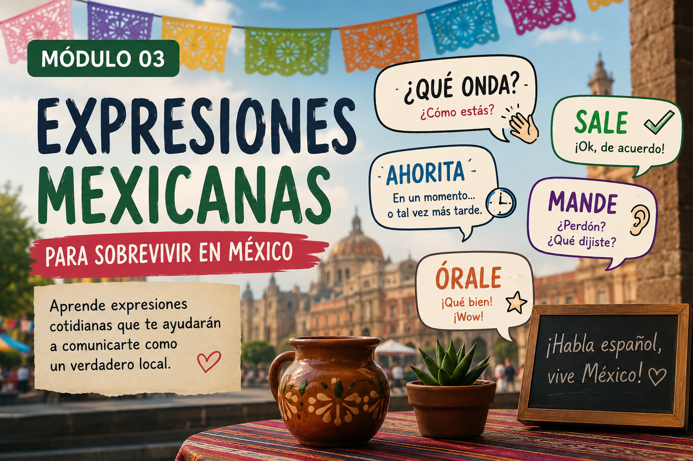

# 🌮 Expresiones mexicanas para sobrevivir en México

  

Durante tu intercambio en México escucharás expresiones que probablemente no aparecen en los libros tradicionales de español.

En este módulo aprenderás algunas frases muy comunes del español mexicano cotidiano para comprender mejor a las personas y comunicarte de manera más natural.

---

# 🗣️ 1. ¿Qué onda?

## Significado
Saludo informal equivalente a:
- “¿Cómo estás?”
- “¿Qué pasa?”
- “¿Qué tal?”

## Ejemplo

**Luis:** “¡Qué onda!”  
**Emma:** “Todo bien, ¿y tú?”

## Contexto
Se utiliza principalmente entre amigos y personas jóvenes.

---

# 👍 2. Sale

## Significado
Expresión utilizada para:
- aceptar algo
- confirmar un plan
- decir “ok”

## Ejemplo

**Ana:** “Nos vemos mañana a las 8.”  
**Carlos:** “¡Sale!”

## Contexto
Muy frecuente en conversaciones informales.

---

# ⏰ 3. Ahorita

## Significado
Puede significar:
- ahora mismo
- en un momento
- más tarde

⚠️ El significado depende mucho del contexto y de la persona.

## Ejemplo

**Profesor:** “Ahorita revisamos la actividad.”

## Contexto
Es una de las expresiones más características del español mexicano.

---

# 🙋 4. Mande

## Significado
Forma cortés de pedir que alguien repita algo.

Equivale a:
- “¿Perdón?”
- “¿Qué dijiste?”

## Ejemplo

**Recepcionista:** “Pase a la oficina 4.”  
**Estudiante:** “¿Mande?”

## Contexto
Muy común en México y considerado una forma educada de responder.

---

# 😮 5. Órale

## Significado
Expresión muy versátil que puede indicar:
- sorpresa
- emoción
- aprobación
- ánimo

## Ejemplo

**María:** “¡Aprobé el examen!”  
**José:** “¡Órale! ¡Qué bien!”

## Contexto
El significado cambia según la entonación y la situación.

---

# 🧩 Actividad breve

Relaciona cada expresión con su significado:

| Expresión | Significado |
|---|---|
| ¿Qué onda? | _____ |
| Sale | _____ |
| Ahorita | _____ |
| Mande | _____ |
| Órale | _____ |

---

# 💬 Reflexión cultural

Las expresiones mexicanas forman parte importante de la vida cotidiana y ayudan a crear cercanía en las conversaciones.

Comprenderlas te permitirá integrarte mejor durante tu intercambio en México.

---

# 🚀 Continuar

👉 [Ir al módulo de vida universitaria](https://margerar.github.io/mi-curso-elemex/04-universidad/04-01.universidad.md)