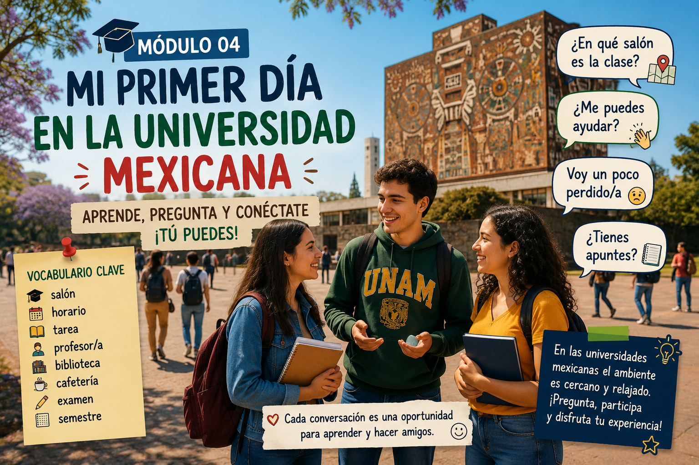

# 🎓 Mi primer día en la universidad mexicana

  

Comenzar clases en una universidad mexicana puede ser emocionante, pero también un poco confuso al principio.

En este módulo aprenderás vocabulario y expresiones útiles para desenvolverte en la vida universitaria cotidiana en México.

---

# 🏫 Situación

Acabas de llegar a tu universidad en México para iniciar tu intercambio académico.

Necesitas:
- encontrar tu salón
- hablar con otros estudiantes
- comprender indicaciones
- pedir ayuda
- adaptarte al ambiente universitario

---

# 🎯 Objetivos

Al finalizar este módulo podrás:

- presentarte de manera sencilla
- pedir información dentro de la universidad
- comprender expresiones frecuentes entre estudiantes
- utilizar vocabulario básico universitario
- interactuar en situaciones cotidianas

---

# 🧩 Vocabulario útil

| Español | Significado |
|---|---|
| salón | classroom |
| horario | schedule |
| tarea | homework |
| profesor/a | teacher |
| biblioteca | library |
| cafetería | cafeteria |
| examen | exam |
| semestre | semester |

---

# 💬 Expresiones comunes

## "¿En qué salón es la clase?"
Pregunta para localizar un aula.

---

## "¿Me puedes ayudar?"
Forma cortés de pedir ayuda.

---

## "Voy un poco perdido/a"
Expresión común cuando no entiendes algo o no sabes dónde ir.

---

## "¿Tienes apuntes?"
Pregunta frecuente entre estudiantes universitarios.

---

# 👥 Mini diálogo

**Estudiante mexicano:**  
"¿También eres de intercambio?"

**Tú:**  
"Sí, acabo de llegar esta semana."

**Estudiante mexicano:**  
"¡Órale! Bienvenido/a."

---

# 🌮 Diferencia cultural

En muchas universidades mexicanas el ambiente suele ser cercano e informal.

Es común que los estudiantes:
- usen expresiones coloquiales
- trabajen en equipo
- hablen de manera relajada con sus compañeros

---

# 🎮 Actividad interactiva

En la siguiente actividad interactiva practicarás una conversación con estudiantes mexicanos durante tu primer día de clases.

👉 [Abrir simulación interactiva en Ren'Py](https://margerar.github.io/mi-curso-elemex/04-universidad/JuegoEspMex-1.0-web/index.html ':target=_blank')

---

# 🚀 Continuar

👉 [Ir al módulo de comida mexicana](../05-comida/05-01.comida.md)
