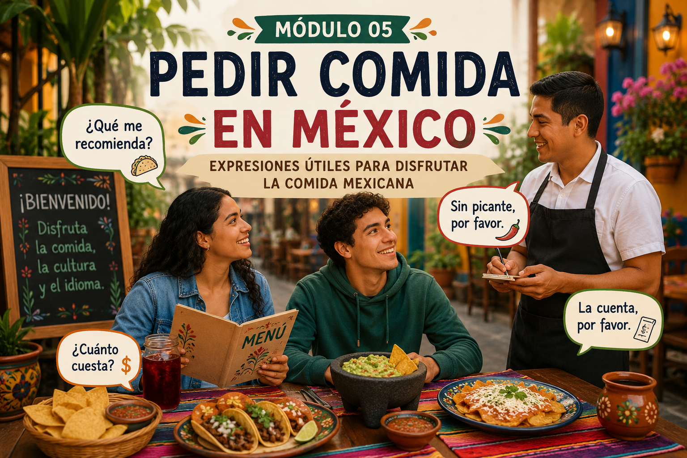

# 🌮 Pedir comida en México

  

La comida es una parte muy importante de la cultura mexicana.

Durante tu intercambio probablemente visitarás cafeterías universitarias, restaurantes y puestos de comida callejera donde escucharás expresiones y vocabulario diferentes a los de los libros tradicionales.

En este módulo aprenderás frases útiles para pedir comida y comunicarte de manera natural en México.

---

# 🍽️ Situación

Acabas de salir de clases y decides ir a comer con algunos compañeros mexicanos.

Necesitas:
- leer un menú
- pedir comida y bebidas
- preguntar precios
- hablar con el mesero
- entender expresiones comunes

---

# 🎯 Objetivos

Al finalizar este módulo podrás:

- pedir comida en un restaurante mexicano
- comprender vocabulario relacionado con alimentos
- utilizar expresiones de cortesía
- preguntar precios y recomendaciones
- interactuar en situaciones cotidianas

---

# 🧩 Vocabulario útil

| Español | Significado |
|---|---|
| mesero | waiter |
| menú | menu |
| cuenta | bill/check |
| bebida | drink |
| propina | tip |
| picante | spicy |
| tacos | tacos |
| agua fresca | fruit drink |

---

# 💬 Expresiones comunes

## "¿Qué me recomienda?"
Pregunta común para pedir sugerencias.

---

## "Sin picante, por favor."
Expresión útil si no toleras comida picante.

---

## "La cuenta, por favor."
Forma educada de pedir la cuenta.

---

## "¿Cuánto cuesta?"
Pregunta para saber el precio de algo.

---

# 👥 Mini diálogo

**Mesero:**  
"Buenas tardes, ¿qué van a ordenar?"

**Tú:**  
"Me gustaría unos tacos y una agua de jamaica, por favor."

**Mesero:**  
"Claro. ¿Desea algo más?"

**Tú:**  
"No, gracias."

---

# 🌮 Diferencia cultural

En México es común:
- compartir comida
- comer tacos en puestos callejeros
- utilizar expresiones informales al ordenar
- dejar propina en restaurantes

Muchos platillos mexicanos también pueden ser bastante picantes.

---

# 📄 Menú descargable

Puedes consultar un menú mexicano de ejemplo aquí:

👉 [Abrir menú del restaurante](./menu_restaurante.pdf)

---

# 📝 Actividad práctica

Ahora realiza una actividad de comprensión y práctica utilizando el menú del restaurante.

👉 [Ir a la actividad del menú](./actividades/actividad_menu.md)

---

# 🌮 Reflexión cultural

La comida mexicana no es solo parte de la gastronomía, sino también de la convivencia social y de la vida cotidiana.

Compartir comida suele ser una experiencia importante durante reuniones familiares, universitarias y encuentros entre amigos.

---

# 🚀 Continuar

👉 [Ir al módulo de transporte en México](../06-transporte/06-01.transporte.md)
