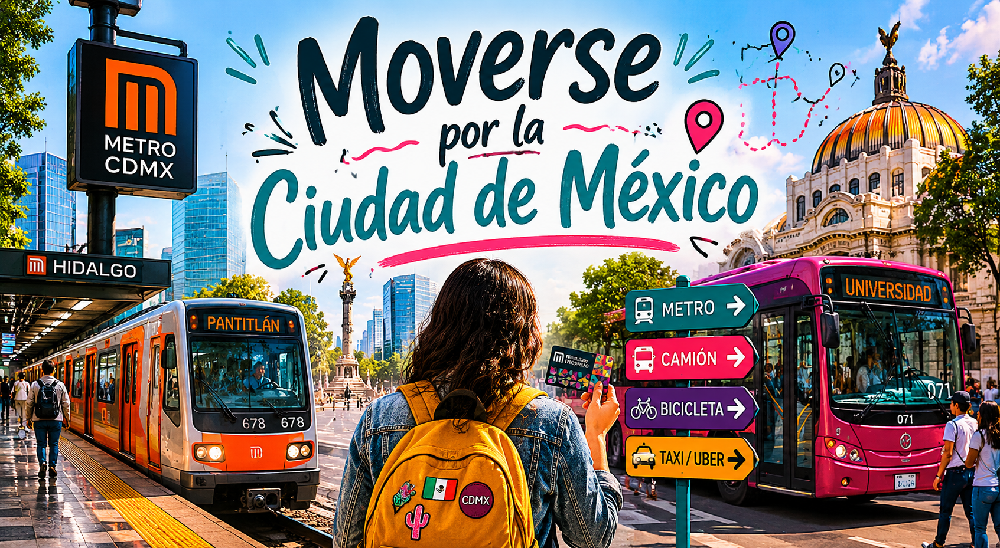

# 🚌 Moverse por la Ciudad de México

  

La Ciudad de México es una de las ciudades más grandes del mundo y cuenta con diferentes medios de transporte que utilizan millones de personas todos los días.

Durante tu intercambio necesitarás aprender a desplazarte por la ciudad para llegar a clases, visitar lugares turísticos y reunirte con amigos.

En este módulo aprenderás vocabulario y expresiones útiles relacionadas con el transporte en México.

---

# 🚇 Situación

Es tu primera semana en Ciudad de México y necesitas llegar a la universidad utilizando transporte público.

Necesitas:
- pedir direcciones
- entender indicaciones
- usar el metro o el autobús
- preguntar precios
- utilizar expresiones comunes

---

# 🎯 Objetivos

Al finalizar este módulo podrás:

- preguntar cómo llegar a un lugar
- comprender vocabulario relacionado con transporte
- utilizar expresiones frecuentes en México
- pedir ayuda al usar transporte público
- interactuar en situaciones cotidianas

---

# 🧩 Vocabulario útil

| Español | Significado |
|---|---|
| metro | subway |
| camión | bus |
| estación | station |
| tarjeta de movilidad | transport card |
| boleto | ticket |
| parada | stop |
| tráfico | traffic |
| ruta | route |

---

# 💬 Expresiones comunes

## "¿Cómo llego al centro?"
Pregunta para pedir direcciones.

---

## "¿Este camión pasa por la universidad?"
Pregunta común para confirmar una ruta.

---

## "Bajo en la siguiente."
Expresión utilizada al acercarse a una parada.

---

## "¿Cuánto cuesta el boleto?"
Pregunta para conocer el precio del transporte.

---

# 👥 Mini diálogo

**Estudiante:**  
"Disculpa, ¿este metro va al centro?"

**Empleado:**  
"Sí, pero tienes que cambiar de línea en Hidalgo."

**Estudiante:**  
"Gracias."

**Empleado:**  
"De nada."

---

# 🌮 Diferencia cultural

En México algunas palabras relacionadas con transporte cambian dependiendo de la región.

Por ejemplo:
- "camión" puede significar autobús urbano
- "pesero" es una forma informal de referirse a ciertos transportes colectivos
- en Ciudad de México muchas personas utilizan el metro diariamente

También es común escuchar música, vendedores o anuncios dentro del transporte público.

---

# 📝 Actividad práctica

Realiza una actividad para practicar direcciones y transporte en México.

👉 [Ir a la actividad de transporte](./actividades/actividad_transporte.md)

---

# 📥 Descargar

Puedes descargar el curso completo en formato EPUB:

👉 [Descargar curso.epub](./epub/mi_intercambio_en_mexico.epub)

---

# 🚀 Continuar

👉 [Ir a la presentación del curso](https://margerar.github.io/mi-curso-elemex/presentacion/index.html ':target=_blank')
