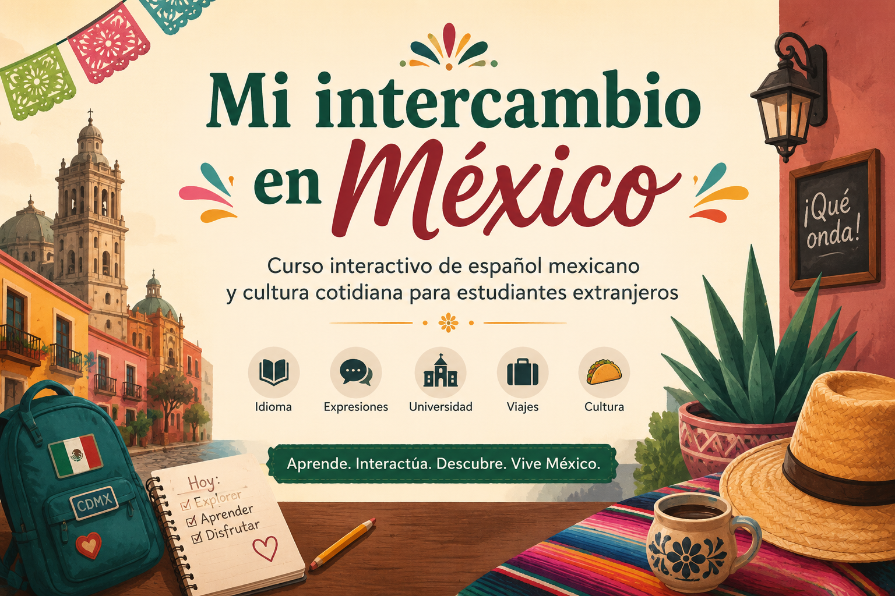

# 🇲🇽 Mi intercambio en México

  

## Curso interactivo de español mexicano y cultura cotidiana para estudiantes extranjeros

Bienvenido/a a *Mi intercambio en México*, un curso digital diseñado para estudiantes de español como lengua extranjera (ELE) de nivel A1-A2.

A través de materiales interactivos, narrativas digitales y recursos multimedia, aprenderás expresiones mexicanas, situaciones cotidianas y vocabulario útil para desenvolverte durante un intercambio.

---

# 📚 Contenido del curso

- Introducción al curso
- Llegada al aeropuerto
- Expresiones mexicanas básicas
- Vida universitaria en México
- Narrativas interactivas
- Recursos descargables

---

# 🎮 Herramientas utilizadas

- Markdown
- Docsify
- GitHub Pages
- Twine
- Ren'Py
- reveal.js
- Pandoc

---

# 🚀 Comenzar

👉 [Ir a la introducción](/01-introduccion/01-01.leccion.md)
